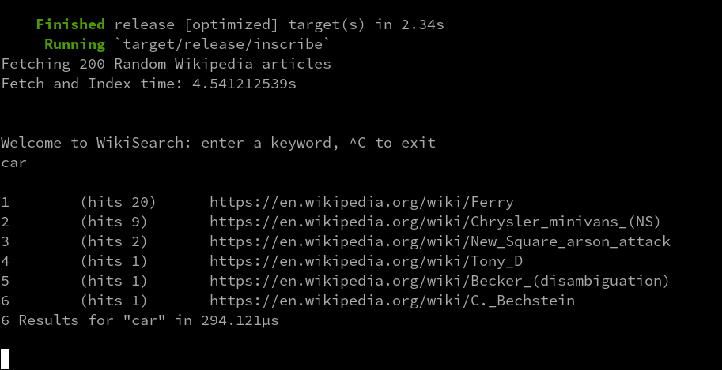

# Wikipedia Download and Search App

## Task
Download 200 random Wikipedia Articles, index them with an algorithm of choosing and allow user to search. Rank results on a given 'weight'

## Design Decision

### Fetching and indexing random pages
My first concern was the cost of parsing/extracting the text from the Markdown using the a non API HTTP call. Browsing the API I discovered I could request `n` random pages and their plain text extracts and return the response as JSON. 
Each page returned is marshaled to the following object.
```rust
pub struct Page {
    pub pageid: i32,
    pub title: String,
    pub fullurl: String,
    pub extract: String,
}
```
 the  plain text extract was then 'stemmed' using a PorterStemmer lib/crate. With a final pass generating the `(word,count)` using the cardinality of the sets of stem occurrences. The resulting  `Record` object is then used by iterators to generate search responses.

### Arch approach
To satisfy 'fast',  I used Rust's Async IO Tasks, with an multi-thread/core executor.   On my machine I have 32 Ryzen cores, so 200 downloads should be quick.  To avoid the overhead of constant progress callbacks hindering the advancement of tasks I added a `MECHANICAL_SYMPATHY_DIAL` throttling the number of active requests. On my box I could set this high, 5 * 32 was my chosen value, allowing for almost 150 concurrent/async requests.  This is a guess and would need tuning, and could also be finer tuned by detecting machine cores. 

#### Fetch Random Pages and Index
 The `DB` (Vector of `Records`) is generated using Rusts collections and iterators to execute closures/functions  on the data we retrieve back
```
1. Fetch Link x 200
2. For Each Page, 
    1. Marshall to Object
    2. Run PorterStemmer Gen on extract
    3. Trasnsform output of above to [(keyword,count)] index for each article
3. Return 200 Indexed Records
```
When the 200 complete `Tasks` we have a `db` of `IndexedRecords`
## Screenshots



### Ranking
I am ranking by the frequency with which the word is found in the Doc.
I had planned some more adventurous search ideas, but in the end I only implemented a naive Porter Stemmer - the code is structured to allow plugging in of Algorithms


### Performance
- Average fetch and index across 10 runs in ~4 seconds, but have seen extremes of 15 seconds
- Average searches using [most common keyword](http://www.thingsmadethinkable.com/item/words_on_wikipedia.php) returns in ~911us
Some suggestions for speeding this up below.


## Optimisations
- Parallel the indexing, Currently the indexing happens on the thread allocated to Async Task fetching the response; although this is a fair approach for 200 calls, a larger batch may benefit from thread-pooling and explicit parallellism for index generation
- Cache the results
- Lazily enhance search meta data on each call
- More advanced/chained stemmers
- More advanced rankers, e.g  adding a weight for the number of articles referenced by this article using using the same keyword
- Better API usage/access (see constraints below)
- Add StopWords filter


## Constraints
 - This is keyword search only, didn't get around to more advance searches
 - Data is only avialable while app is alive (all in mem)
 - My Wikipedia API accesses would only generate 1 article with a full plain text extract , so I had to make 200 http calls instead of 1
 - Given I had to read some Rust docs , this took about 5hrs - I called it 'done' with outstanding refactors, more unit tests and optimisations

